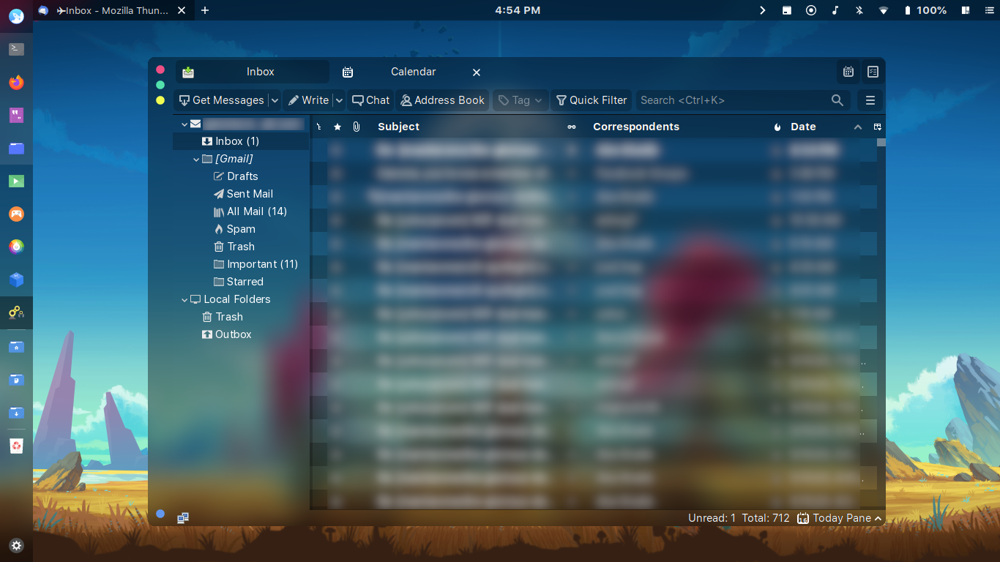
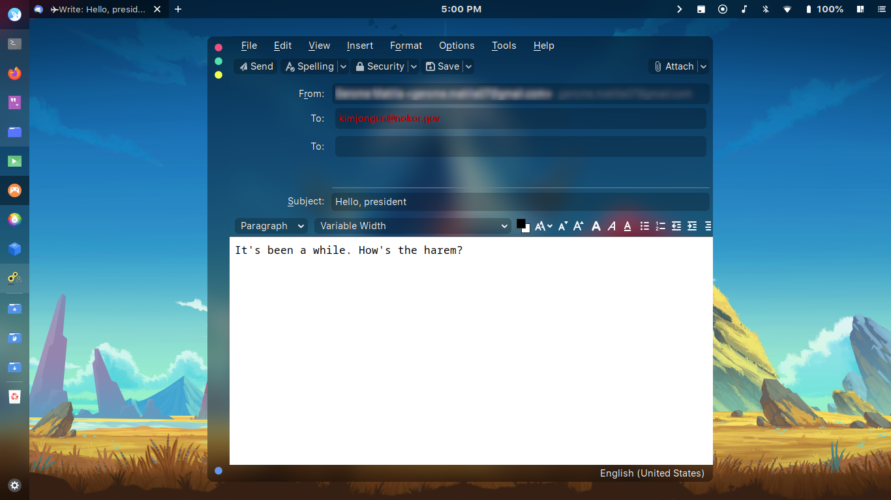

## Thunderblur

### A blurred CSS theme for Thunderbird

| Inbox |
| --- |
|  |

| Calendar |
| --- |
|  |

| Compose Window |
| --- |
|  |

## How to

1. Open the Thunderbird Menu located on the top-right corner with a humburger menu(three horizontal lines).
2. Select `Preferences`, then `Preferences` again.
3. Go to `Advanced`, find the `Config Editor` button then press it.
4. A dialog will warn you, but ignore it, ~~just do it~~ press the `I accept the risk!` button.
5. Search for `toolkit.legacyUserProfileCustomizations.stylesheets`, `layers.acceleration.force-enabled`, `gfx.webrender.all`, and `svg.context-properties.content.enabled`. Make sure to enable them all!
6. Go to your thunderbird profile located in `$HOME/.thunderbird/XXXXXXX.default-release`.
7. Create the `chrome` folder, then assuming that you already clone this repo, just copy the content to the `chrome` folder.

It's been a while since I dwell with CSS so the theme is **kinda** messy right now. I'll clean this up from time to time, tho.